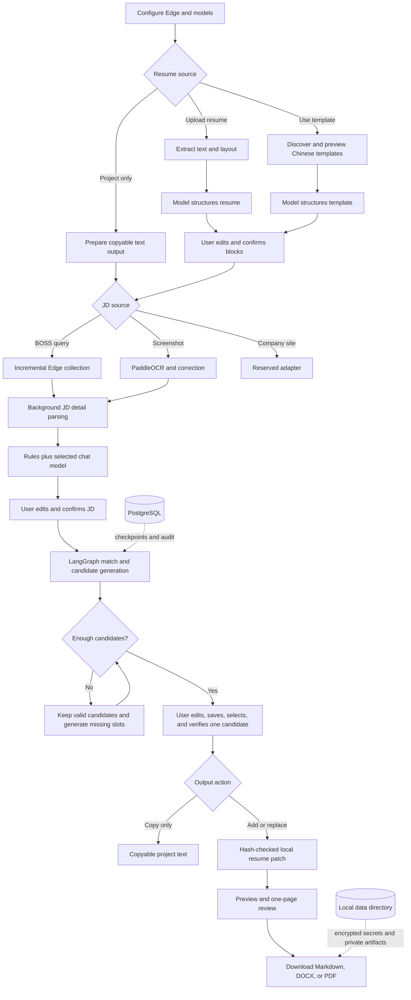

# Resume Agent

<div align="center">

**A local-first Chinese resume tailoring agent for job discovery, JD analysis, project generation, resume editing, and one-page export.**

[English](README.md) · [简体中文](README.zh-CN.md)


</div>

Resume Agent turns a target job description into concrete, reviewable Chinese resume content. It can search BOSS jobs through an isolated Microsoft Edge profile, parse a selected JD with either an OpenAI-compatible or local Ollama model, generate multiple project candidates, replace a selected project in an uploaded resume, and export Markdown, DOCX, or PDF.

The application is designed around human confirmation. Model-inferred claims remain marked for verification, template and resume structures are editable before use, and every resume mutation is applied as a field-level patch with hash and checkpoint conflict checks.

> Project status: active local-first MVP. BOSS page structure and anti-abuse behavior can change without notice, so real-site collection still requires manual regression testing after Edge or BOSS updates.

## Highlights

- Guided Streamlit workflow instead of a crowded multi-panel form.
- FastAPI backend with LangChain + LangGraph orchestration and durable `thread_id` checkpoints.
- Standard MCP servers implemented with FastMCP over `stdio` for BOSS collection and GitHub template discovery.
- OpenAI-compatible cloud chat/embedding profiles and dynamically discovered Ollama models.
- Encrypted, machine-local cloud API-key persistence; secrets are never written to PostgreSQL or Git.
- Upload one DOCX, Markdown, TXT, or text-based PDF (up to 10 MB and 3 PDF pages).
- Model-assisted resume/template structure parsing followed by editable user confirmation.
- Screenshot paste/upload with PaddleOCR v6, correction, model enhancement, and rule/OCR fallback.
- Incremental BOSS result batches with retained search-tab recovery and background JD detail parsing.
- Skill parsing preserves alternatives such as “Python, Java, or Go — choose one” as an OR group.
- Candidate generation preserves valid earlier results and tops up until the requested count is reached.
- Every generated candidate is directly editable and durably saved before selection; saving invalidates old field confirmations and records hash-based edit metadata.
- Explicit add/replace project selection with auditable old-value hashes.
- Markdown, DOCX, and PDF preview/download; DOCX can be rendered to PDF for visual review.
- One-page checks and user-approved layout compression before any content rewrite.

## Workflow



## Architecture

| Layer | Implementation |
| --- | --- |
| Web UI | Streamlit |
| HTTP API | FastAPI |
| Agent workflow | LangChain + LangGraph |
| Persistence | PostgreSQL in Docker; SQLite fallback for local trial |
| MCP | FastMCP `stdio` servers managed by FastAPI |
| BOSS browser | Microsoft Edge with an isolated app-owned profile and loopback CDP |
| OCR | PaddleOCR v6 medium |
| Documents | `python-docx`, PyMuPDF, Word or LibreOffice for visual conversion |
| Models | OpenAI-compatible chat/embedding APIs or Ollama |

## Requirements

The first release targets Windows 10/11.

- [uv](https://docs.astral.sh/uv/) and Python 3.11+ (Python 3.12 recommended)
- Git
- Microsoft Edge
- Docker Desktop for the recommended PostgreSQL setup
- Optional: Ollama for local chat and embedding models
- Optional: Microsoft Word or LibreOffice for DOCX-to-PDF preview/export
- Optional: PaddleOCR dependencies for screenshot parsing

Install common tools from PowerShell:

```powershell
winget install --id astral-sh.uv -e
winget install --id Git.Git -e
winget install --id Microsoft.Edge -e
winget install --id Docker.DockerDesktop -e
```

## Quick Start

### 1. Clone and install

```powershell
git clone <YOUR_GITHUB_REPOSITORY_URL> resume-agent
Set-Location resume-agent
uv python install 3.12
uv venv --python 3.12 .venv
uv sync --extra ui --extra mcp --extra documents --extra ocr --extra dev
```

If `.venv` already exists, keep it and run only `uv sync ...`; the project does not require recreating or downgrading the environment.

On Windows, uv may report that hardlinks are unavailable and that it is falling back to copies. This is harmless. To suppress the warning for the current terminal:

```powershell
$env:UV_LINK_MODE="copy"
uv sync --extra ui --extra mcp --extra documents --extra ocr --extra dev
```

### 2. Configure and start PostgreSQL

```powershell
Copy-Item .env.example .env
docker compose up -d postgres
docker compose ps
uv run python -m alembic upgrade head
```

Only PostgreSQL runs in Docker. FastAPI, Streamlit, Edge, MCP child processes, OCR, and models run locally.

For a lightweight trial, omit `RESUME_AGENT_DATABASE_URL` and run `uv run python scripts/init_db.py`; the application then uses `data/resume_agent.db`. PostgreSQL is recommended for durable use.

### 3. Start the backend

```powershell
uv run python -m uvicorn app.main:app --host 127.0.0.1 --port 8000
```

FastAPI owns both FastMCP `stdio` processes. Do not launch the BOSS or GitHub MCP server separately.

### 4. Start the web UI

Open a second PowerShell window in the repository:

```powershell
uv run python -m streamlit run app/ui/streamlit_app.py --server.address 127.0.0.1 --server.port 8666
```

Open:

- Web UI: <http://127.0.0.1:8666>
- API health: <http://127.0.0.1:8000/api/health>
- OpenAPI: <http://127.0.0.1:8000/docs>

## Stop, Restart, and Preserve Data

Use a graceful shutdown so the app can close every tab in its isolated collection Edge profile and avoid an Edge “Restore pages” prompt on the next launch.

1. In the web UI, click **Restart** if a BOSS collection session is open. The backend closes detail/user tabs one by one and closes the retained search tab last.
2. In the Streamlit PowerShell window, press `Ctrl+C`.
3. In the FastAPI PowerShell window, press `Ctrl+C`. FastAPI's shutdown hook also closes the BOSS MCP process and all app-owned Edge tabs, so this step is the final browser cleanup fallback.
4. Stop PostgreSQL when it is no longer needed:

```powershell
docker compose stop postgres
```

To start again, run `docker compose up -d postgres`, then start FastAPI and Streamlit with the commands above. `docker compose stop` preserves all database data. `docker compose down` removes the container and network but keeps the named volume; **do not run `docker compose down -v` unless you intentionally want to delete all PostgreSQL data**.

If a terminal is forcibly killed, start the backend once and use **Restart** before closing it normally. The application never closes the user's everyday Edge profile—only the isolated process recorded under `data/edge-profile`.

## What PostgreSQL Does

PostgreSQL is the durable workflow store, not a model runtime or file store. It keeps:

- tasks, `thread_id`, LangGraph checkpoint versions, node state, leases, and recovery metadata;
- parsed job/JD and resume structures, model profile metadata, candidate versions, feedback, user confirmations, and module decisions;
- field-level patch/audit records, old-value hashes, snapshot references, and export metadata.

Uploaded resumes, OCR images, generated artifacts, the authenticated Edge profile, and encrypted API-key material stay under the private local `data/` tree rather than inside Git. API keys are not stored in PostgreSQL: only a non-secret profile/credential reference is persisted, while the encrypted secret remains machine-local. The PostgreSQL container may be stopped without losing state; data is lost only if its named volume is explicitly deleted or the database is otherwise removed.

## Model Setup

Configure models in the first page of the UI.

### OpenAI-compatible providers

Enter the provider's base URL, exact model ID, and API key, then click the connection test button.

- Use a base URL ending in `/v1`, for example `https://api.openai.com/v1`.
- A pasted `/chat/completions` URL is normalized back to the API root.
- Chat and embedding profiles are configured separately and may use different providers or keys.
- Select `Bearer Key` unless the provider explicitly requires the raw key in `Authorization`.
- The API key is encrypted locally and restored for later calls; the UI shows only a mask.
- External-model consent is requested once before resume or JD content is sent.

### Ollama

```powershell
winget install --id Ollama.Ollama -e
ollama pull qwen2.5:7b
ollama pull bge-m3
ollama list
```

Start `ollama serve` if the service is not already running. The UI reads the live Ollama model list and lets you select real installed chat and embedding models independently. It never silently downloads a model.

## Screenshot OCR

Install the `ocr` extra, then pre-download PP-OCRv6 medium once:

```powershell
uv run python -c "from paddleocr import PaddleOCR; PaddleOCR(text_detection_model_name='PP-OCRv6_medium_det', text_recognition_model_name='PP-OCRv6_medium_rec', use_doc_orientation_classify=False, use_doc_unwarping=False, use_textline_orientation=False, device='cpu', enable_mkldnn=False); print('PP-OCRv6 medium ready')"
```

Models are normally cached under `%USERPROFILE%\.paddlex\official_models`. The application accepts pasted or uploaded PNG, JPEG, WEBP, and BMP files up to 10 MB. If model enhancement fails, the confirmed OCR text and rule result stay available for correction and retry.

## BOSS Collection Behavior

- Uses a dedicated Edge profile under `data/edge-profile`; it never attaches to the user's everyday Edge profile.
- Login, CAPTCHA, slider, and risk-control steps are always completed manually.
- The collection window stays minimized after login. Detail parsing creates a background Chromium target and does not take focus.
- Results are fetched in batches of 10. “Next page” restores the retained search tab, scrolls to the last collected card, dispatches trusted wheel input, skips survey/promotional nodes, and retries delayed lazy loading.
- “View in collection Edge” is an explicit foreground action. Later pagination returns to the retained search target even if another tab is active.
- “Restart” closes only the app-owned collection Edge and clears the wizard state.
- Normal backend shutdown applies the same cleanup: every app-owned tab is closed individually before the recorded Edge process exits.
- The application does not bypass BOSS controls and cannot guarantee compatibility with future site changes.

## Resume and Template Rules

- One primary resume per task.
- Text-based PDFs only, up to 10 MB and 3 pages.
- Uploaded resume and selected template structures must be model-parsed, edited if needed, and explicitly confirmed.
- GitHub templates are restricted to Chinese resume files with an allowed license; the picker attempts to provide five high-star/relevant candidates and falls back to the built-in template when needed.
- Model-derived technical plans or claims stay marked `[待核实]` until the user confirms every required field.
- Resume changes are field-level patches. The backend checks both checkpoint version and old-value hash before applying them.
- If a resume exceeds one page, layout compression is proposed first; content rewriting requires separate user consent.

## Export

The completed task page supports:

| Format | Preview | Download |
| --- | --- | --- |
| Markdown | Editable/copyable text | `.md` |
| DOCX | Text plus converted PDF visual preview when Word/LibreOffice is available | `.docx` |
| PDF | Embedded page preview | `.pdf` |

Artifacts are served only through task-scoped authenticated endpoints. The UI never trusts an arbitrary filesystem path.

## Configuration

Copy the tracked placeholder file `.env.example` to the ignored machine-local `.env`, then edit only the values needed for this computer. `.env.example` contains no real credentials and is the configuration template that should remain in Git. Important variables:

| Variable | Default | Purpose |
| --- | --- | --- |
| `POSTGRES_DB`, `POSTGRES_USER`, `POSTGRES_PASSWORD`, `POSTGRES_PORT` | local development values | PostgreSQL container settings; keep `RESUME_AGENT_DATABASE_URL` in sync |
| `RESUME_AGENT_DATABASE_URL` | PostgreSQL example in `.env.example` | SQLAlchemy database URL |
| `RESUME_AGENT_DATA_ROOT` | `./data` | Private runtime files |
| `RESUME_AGENT_API_HOST` | `127.0.0.1` | API bind address |
| `RESUME_AGENT_API_PORT` | `8000` | API port |
| `RESUME_AGENT_EDGE_PATH` | auto-detect | Optional `msedge.exe` path |
| `RESUME_AGENT_OLLAMA_BASE_URL` | `http://127.0.0.1:11434` | Ollama endpoint |
| `RESUME_AGENT_TASK_TIMEOUT_SECONDS` | `300` | Default task timeout |
| `RESUME_AGENT_LOG_RETENTION_DAYS` | `30` | Local log retention |

Do not place cloud API keys or GitHub tokens in `.env`. Cloud model keys are entered in the UI and encrypted locally; GitHub tokens are session-only.

The Compose file binds PostgreSQL to `127.0.0.1` only. Change the example database password before using this beyond a single trusted development machine, and URL-encode special characters when copying it into `RESUME_AGENT_DATABASE_URL`.

## Privacy Before Publishing to GitHub

The repository `.gitignore` excludes:

- `.env`, Streamlit secrets, certificates, and keys;
- `data/`, local databases, encrypted credential files, logs, backups, and the Edge profile;
- uploaded resumes, PDFs, DOCX files, screenshots, previews, and exports;
- `.venv`, `.run/` process logs, caches, editor/agent metadata, and generated package metadata.

Before the first push, still inspect staged files:

```powershell
git status --short
git diff --cached --check
git diff --cached
```

Never commit a real resume, API key, GitHub token, browser profile, cookie, database, or generated artifact.

## Tests

```powershell
uv run python -m pytest -q
uv run python -m compileall -q app tests
uv run python -m ruff check --select E9,F63,F7,F82 app tests
```

## Troubleshooting

<details>
<summary>Cloud model connects once, then later calls fail</summary>

Save and probe the profile once in the UI. The encrypted machine-local secret store will rematerialize the credential handle for later JD, template, resume, and generation calls. If the machine key or encrypted file was manually removed, enter the key once again.
</details>

<details>
<summary>BOSS “Next page” has not produced a new batch</summary>

Keep the app-owned Edge process running. The UI automatically retries a delayed lazy-load cycle and preserves the cursor when BOSS has not emitted an explicit end marker. If BOSS asks for login or verification, complete it manually and submit the search again.
</details>

<details>
<summary>DOCX exists but PDF visual preview is unavailable</summary>

Install Microsoft Word or LibreOffice and restart the backend. Markdown and DOCX downloads remain available when conversion is unavailable; PDF export reports the missing dependency instead of returning a fake file.
</details>

<details>
<summary>GitHub template download times out</summary>

Check DNS, firewall, system proxy, `github.com`, and `raw.githubusercontent.com`. A temporary GitHub token can reduce rate limits but is not persisted. The built-in Chinese template remains available.
</details>

## Repository Layout

```text
app/
  core/       schemas, persistence, model gateway, encrypted secret store
  mcp/        FastMCP BOSS and GitHub servers, Edge adapter, MCP client
  services/   parsing, matching, generation, workflow, templates, export
  ui/         Streamlit application and clipboard components
alembic/      PostgreSQL migrations
docs/         executable technical design
scripts/      database initialization and smoke tests
tests/        unit, API, persistence, MCP, workflow, and export tests
```

## Roadmap

- Implement the reserved company-career-site adapter.
- Add more layout-preserving template adapters and export renderers.
- Add packaged releases and CI once a public repository URL is established.
- Add multi-machine deployment only after the local privacy model is retained.

## Contributing

Issues and pull requests are welcome after the repository is published. Please keep changes local-first, do not weaken confirmation or conflict checks, add tests for workflow changes, and never include real credentials or resumes in fixtures.

## License

No open-source license has been declared yet. Until a `LICENSE` file is added, the source is visible but reuse, modification, and redistribution rights are not granted automatically. Choose and add an appropriate license before announcing the repository as open source.
